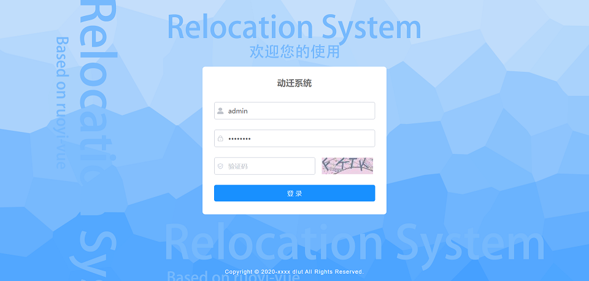
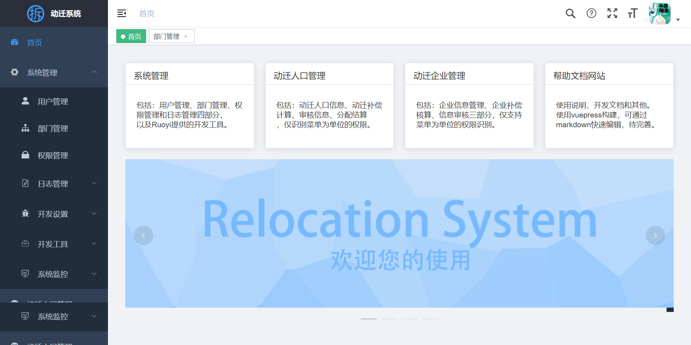
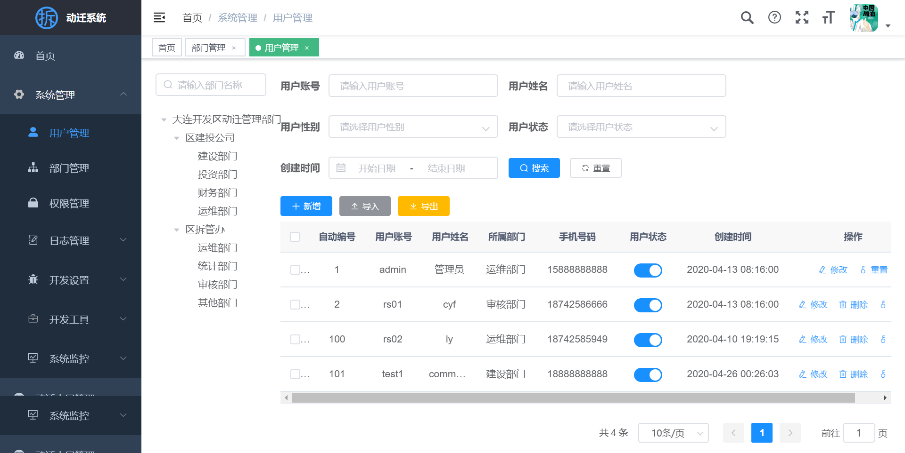
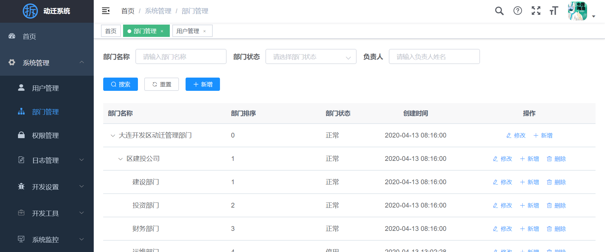
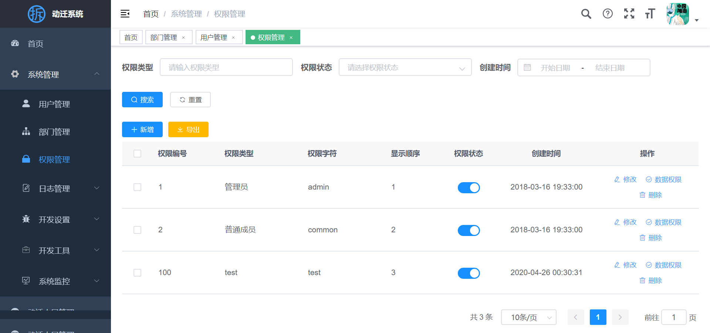
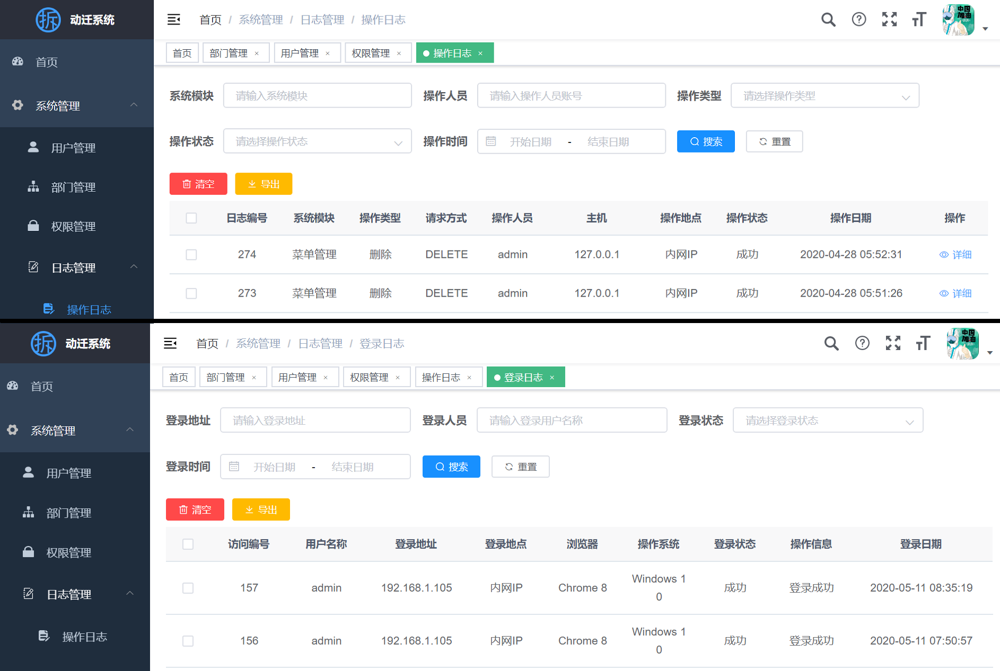

# 使用说明
[在线演示](http://47.93.213.126/login?redirect=/index)  
## 登录界面指引

> 权限：**管理员**；账号：admin；密码：admin123  
#### 登录后首页如下图：

## 系统管理界面指引
系统管理界面主要有：**用户管理**，**部门管理**，**权限管理与日志**。
#### 用户管理

用来采集信息以及更改用户信息，可以进行用户编号，姓名，电话等信息的输入操作。  
另外也可以进行添加，修改以及删除用户的操作。
#### 部门管理

用来采集部门名称信息以及备注信息，可以进行部门名称的输入以及备注信息的输入操作。  
另外，可以进行添加新部门，修改部门以及删除部门等操作。
#### 权限管理

用来输入权限信息并进行设置等。可以进行用户编号以及所属部门的输入操作，并对信息权限进行三种设置，对审核权限可以进行设置。  
另外，可以进行分配，删除，修改用户权等操作。
#### 日志管理
分为操作日志和登录日志两部分。  

**操作日志：** 记录对数据库进行操作的时间、由谁操作以及具体的操作类型等信息；  
**登录日志：** 记录用户登录的时间、ip地址以及浏览器类型等信息。

## 动迁人口管理界面指引
该界面主要可以进行动迁人口信息的输入，动迁人口补偿的计算以及分配结算并提交审核的功能。
#### 动迁人口信息
用户可以在该界面输入动迁人口的基本信息如屋主姓名，原地址等等。该界面主要采集用户的基本信息。
#### 动迁人口补偿
在该界面会要求用户输入房屋的大致情况房屋间数，厨房厕所等房间的数量以及面积等等，用户点击提交后再进行计算并反馈给数据库进行处理运算。
#### 分配结算
在该界面会对已有信息进行整合运算并反馈各个部分的金额以及总数，输入信息包括原房屋情况以及分配房屋的情况。
#### 审核信息
在该界面用户可以到看拆墙房屋的审核情况，可以进行申请审核与反审核的操作。
## 企业信息管理界面指引
该界面主要企业信息管理，企业信息明细，企业补偿核算以及信息审核界面，大致功能操作与动迁人口界面类似。
## 帮助文档指引
参见本站内容。

